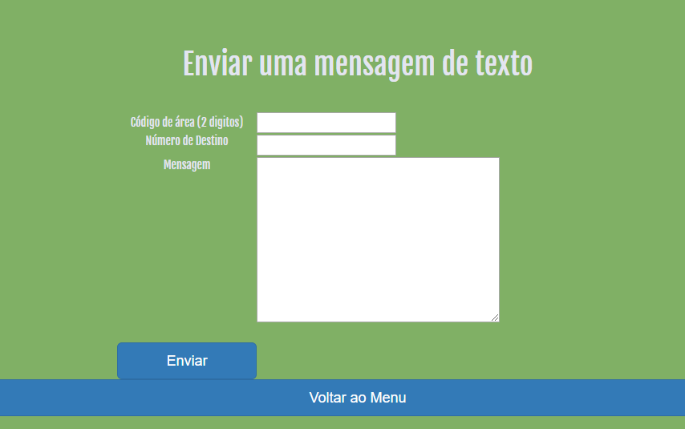

# Sistema de Alerta e Notificações - IFPB

## Descrição

SMS já nao é mais uma tecnologia utilizada na atualidade, mas nesse projeto terá bastante utilidade.

Esse projeto tem como objetivo a realização de envios de SMS via pagina web. O intuito é que o receptor da mensagem não necessite de acesso à internet para visualizar, sendo assim, podendo receber uma notificação em qualquer lugar que esteja dentro da area de cobertura da sua operadora de telefonia.

Os meios de comunicação oficial do Instituto se dá basicamente pelo Q-academico e SUAP. Porém, esses meios de comunicação, nao oferecem um alerta sobre alguma mensagem importante.

Os alunos não possuem o hábito de visualizar com frequencia os sistemas, e por isso, perdem informações importantes.

Entao é por isso que o SAN-IFPB pode vir a ser uma boa solução para a falta de comunicação urgente no Instituto. Ele permite enviar alertas por SMS via página web.

## Objetivos

Acesso á pagina de gerenciamento via web, para envio de mensagens.
Entre as opções de envio e tipo de usuários estão:

## Páginas desenvolvidas inicialmente

*Figura 1 - Página Inicial*

*Figura 2 - Página de Login*

*Figura 3 - Pagina de registro de usuario*

*Figura 4 - Menu Principal*

*Figura 5 - Pagina de registro de usuario*

## Comandos - exemplos
##### Cadastro de usuário com integração ao BD

     <?php
       require_once "users-request.php";

       $user = $_POST["login"];
       $password = $_POST["password"];

       $userResquetDb = new UserRequest("mysql", "mybackupweb", "localhost", "root", "abc123");
       if($user == null || $password == null){
         header("Location: ../source/error.html");
       }
       else{
         $userResquetDb->create_user($user, $password);
         header("Location: ../source/ok.html");
       }
     ?>

##### Autenticação de usuários cadastrado no BD
<? php
  //a tag php é so para deixar organizado o codigo no readme.md
  function validaUsuario($login, $senha) {
  global $_SG;
  $cS = ($_SG['caseSensitive']) ? 'BINARY' : '';
  // Usa a função addslashes para escapar as aspas
  $nusuario = addslashes($login);
  $nsenha = addslashes($senha);
  // Monta uma consulta SQL (query) para procurar um usuário
  $sql = "SELECT `id`, `nome` FROM `".$_SG['tabela']."` WHERE ".$cS." `login` = '".$nlogin."' AND ".$cS." `senha` = '".$nsenha."' LIMIT 1";
  $query = mysql_query($sql);
  $resultado = mysql_fetch_assoc($query);
  // Verifica se encontrou algum registro
  if (empty($resultado)) {
    // Nenhum registro foi encontrado => o usuário é inválido
    return false;

  } else {
    // Definimos dois valores na sessão com os dados do usuário
    $_SESSION['usuarioID'] = $resultado['id']; // Pega o valor da coluna 'id do registro encontrado no MySQL
    $_SESSION['usuarioNome'] = $resultado['nome']; // Pega o valor da coluna 'nome' do registro encontrado no MySQL
    // Verifica a opção se sempre validar o login
    if ($_SG['validaSempre'] == true) {
      // Definimos dois valores na sessão com os dados do login
      $_SESSION['usuarioLogin'] = $login;
      $_SESSION['usuarioSenha'] = $senha;
    }
    return true;
  }
}
?>

##### Criação de tabela users_backups no BD gatewaysms

<?php
//a tag php é so para deixar organizado o codigo no readme.md
CREATE TABLE IF NOT EXISTS `mensagens` (
  `id_mens` int(11) NOT NULL AUTO_INCREMENT,
  `id_user` int(11) NOT NULL,
  `texto` text NOT NULL,
  `destino` varchar(250) NOT NULL,
  `arquivo` varchar(250) NOT NULL,
  PRIMARY KEY (`id_mens`)
) ENGINE=InnoDB  DEFAULT CHARSET=utf8 AUTO_INCREMENT=4 ;
?>
